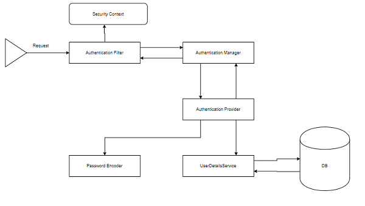

# Spring Authentication

## Read 16
### Spring security Architecture

- Authentication
- Authorization
- “access control” instead of "authorization" both are different

[credit
](https://spring.io/guides/topicals/spring-security-architecture/)

- Authentication usually authenticated=true
- AuthenticationException invalid prinicipal when all providers return null

[credit
](https://spring.io/guides/topicals/spring-security-architecture/)

- ProviderManager support authentication mechanisms

[credit
](https://spring.io/guides/topicals/spring-security-architecture/)

- Use annotations @Configuration; @Autowired; @Bean
- AccessDecisionManager
- AccessDecisionVoter
- ConfigAttributes
- Role_ reperents an expressions that needs to be evealuated

- The clients the container using a chain of filters
- A filter chain proxy can manage multiple filter chains

[credit
](https://spring.io/guides/topicals/spring-security-architecture/)

- WebSecurityConfigurerAdapter has a request matcher
- Matchers apply to different part of the process
- Spring Security is fundamentally thread-bound
- This example is a service with a secure method.
- @Async
- AsyncConfigurer
- Executor

### Spring Auth Cheat Sheet

1. Setup user model repo
2. Controller for model
3. Implement UserDetailsService
4. ApplicationUse UserDetails
5. Websecurity Conif extends WebsecurityConfigureAdapter
6. Registration Page
7. login page

####  References

[Spring Security Architecture
](https://spring.io/guides/topicals/spring-security-architecture/)

[Spring Auth Cheat Sheet](https://github.com/codefellows/seattle-java-401d2/blob/master/SpringAuthCheatSheet.md)

