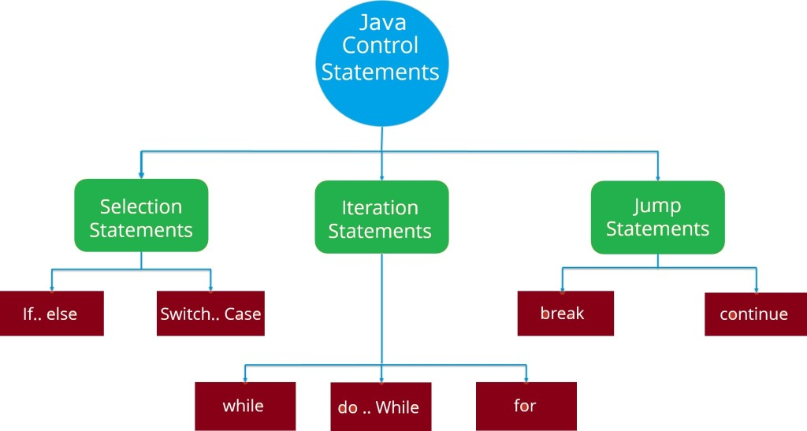
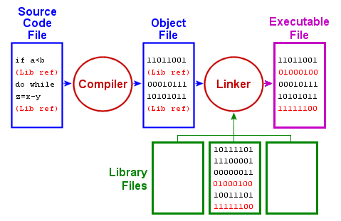

Language Basics
Variables 
Variable is a basic data types consider as object store values examples =>(primitive types, character strings, and arrays), default values.
  

Operators
Operators are symbols that is used to perform operations.
    

Expressions, Statements, and Blocks
Expressions is collection of variables and operaters amnd method that evaluates to a single value

Statements
Is a forms complete unit of execution ends with ;

Blocks
Scope that contains zero or more statement and which initialized in it cannot access to it outside if it and starts and ends with curly brackets.

Control Flow Statements
The way that the computer runs code from top to bottom.
    

Compiling
the step which computer convert the program to their language (0&1)to run it and comunucate with it.
    

