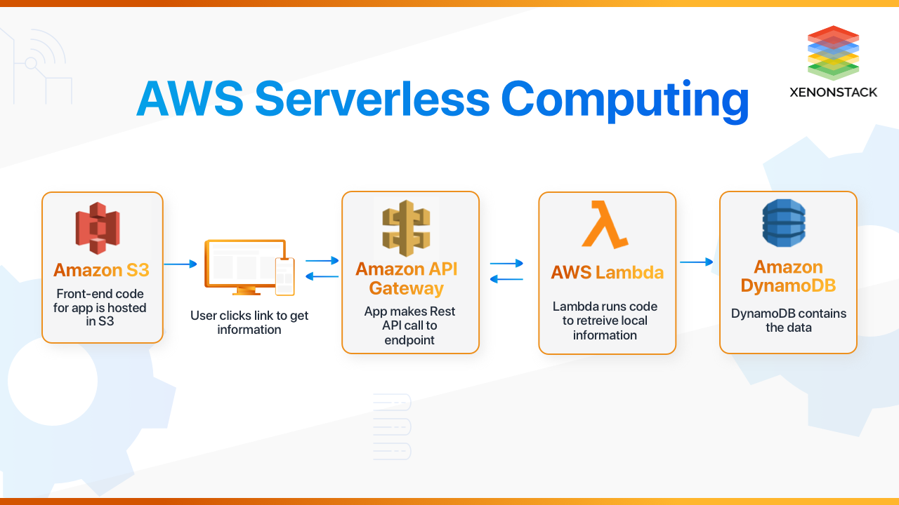

## Read: 32 
## Serverless and Amplify

# Serverless
- Serverless is a cloud computing execution model where the cloud provider dynamically manages the allocation and provisioning of servers. A serverless application runs in stateless compute containers that are event-triggered, ephemeral (may last for one invocation), and fully managed by the cloud provider. Pricing is based on the number of executions rather than pre-purchased compute capacity, isn’t it the ideal framework for that project you have been planning since a long time? Well, go ahead do it.

- Serverless applications are event-driven cloud-based systems where application development rely solely on a combination of third-party services, client-side logic and cloud-hosted remote procedure calls (Functions as a Service).

## serverless cloud providers
- verona
- AWS Lambda
- Google Cloud Functions
- Azure Functions
- IBM OpenWhisk
- Alibaba Function Compute
- Iron Functions
- Auth0 Webtask
- Oracle Fn Project
- Kubeless
- Traditional vs. Serverless Architecture

Pricing
One of the major advantages of using Serverless is reduced cost, for years the cost of provisioning servers and maintaining that 24x7 server team which blew a hole in your pocket is gone. with a peak execution time of 300-second for most Cloud vendors.

Networking
The downside is that Serverless functions are accessed only as private APIs

## Frameworks
Serverless Framework (Javascript, Python, Golang)
Apex (Javascript)
ClaudiaJS (Javascript)
Sparta (Golang)
Gordon (Javascript)
Zappa (Python)
Up (Javascript, Python, Golang, Crystal)

AWS Amplify
AWS Amplify is a set of purpose-built tools and features that lets front-end web and mobile developers quickly and easily build full-stack applications on AWS, with the flexibility to leverage the breadth of AWS services as your use cases evolve.

API (GraphQL), Data Modeling
Setup database tables
@model will create a database table, and automatically add an id field as a primary key to the database table(you can override it by @primaryKey), also adds the helper fields createdAt and updatedAt to your type.

### Resources

[Intro to Serverless](https://hackernoon.com/what-is-serverless-architecture-what-are-its-pros-and-cons-cc4b804022e9/)  

[AWS Amplify Kool-Aid](https://aws.amazon.com/amplify/)  
[GraphQL Intro ](https://docs.amplify.aws/cli/graphql/data-modeling/)  