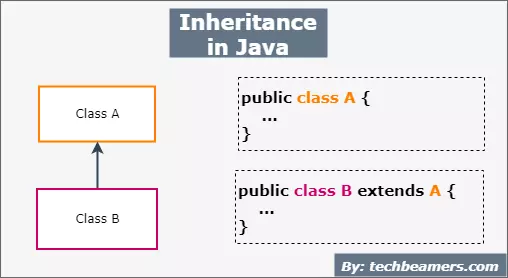

 ## What Is an Object
Java object is like member of a Java class. Each object has an identity, a behavior, and a state.

 ## What Is a Class?
Class in java template used to create objects and to define object data types and methods.

 ## What Is Inheritance?
mechanism in which one object acquires all the properties and behaviors of a parent object.
  

 ## What Is an Interface?
An interface in java is an abstract type used to specify the behavior of a class.
  
