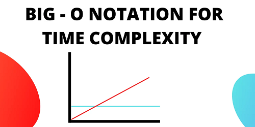
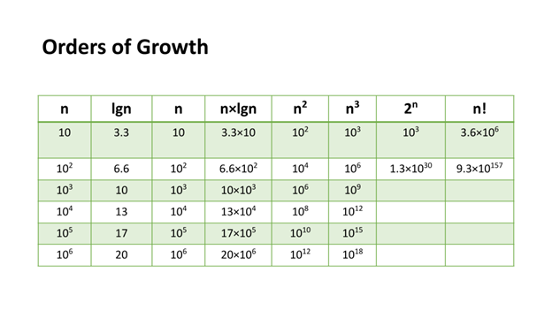
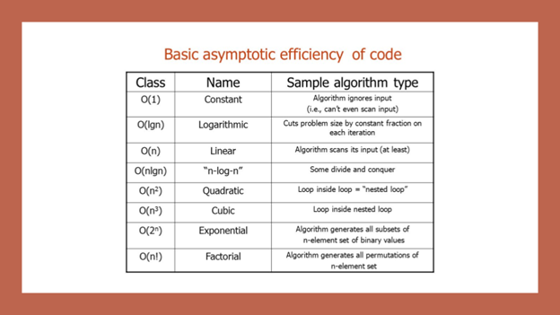
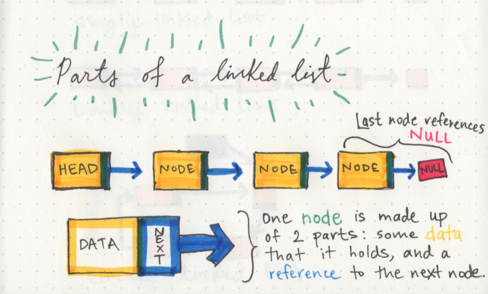
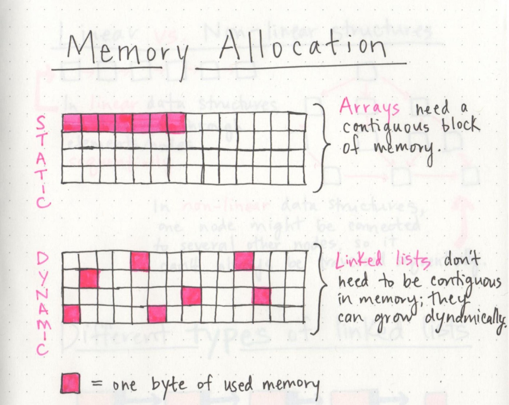

### Big O in Java 

describes the set of all algorithms that run no worse than a certain speed.
Big O Notation is a way to measure an algorithm's efficiency.
O(n) represents the complexity of a function that increases linearly and in direct proportion to the number of inputs.
Running Time (also known as time efficiency / complexity)
The amount of time a function needs to complete.
Memory Space (also known as space efficiency / complexity)
The amount of memory resources a function uses to store data and instructions.

  

### Input Size

Input Size refers to the size of the parameter values that are read by the algorithm. The size of each parameter value as well.The higher this number, the more likely there will be an increase to Running Time and Memory Space.

### Units of Measurement

Always be aware that Space Complexity and Time Complexity are measured differently and should be analyzed separately. It’s also worth noting that contemporary computing affords most machinees with multiple GigaBytes of working memory, so algorithm space 
complexity is not as much of a concern as it used to be.

### Orders of Growth

We can describe overall efficiency by using the input size n and measuring the overall Units of Space and Time required for the given input size n. As the value of n grows, the Order of Growth represents the increase in Running Time or Memory Space.
  
    

### Linked Lists

A Linked List is a sequence of Nodes that are connected/linked to each other.the node connected to next node.

Terminology:
Linked List / Node / Next Head - the first node in a linked list. / Current - that is currently being looked at. 
  
    

 > - Singly and Doubly. We will be implementing a Singly Linked List in this implementation.

### Types Singly_Doubly
Singly / Doubly A Doubly linked list means that there is a reference to both the Next and Previous node.
  
    
    

###  Traversal Big O
The Big O of time for Includes would be O(n). This is because, at its worse case, the node we are looking for will be the very last node in the linked list. n represents the number of nodes in the linked list.
The Big O of space for Includes would be O(1). This is because there is no additional space being used than what is already given to us with the linked list input.
Adding a Node O(1)

  

  ### Difference between linkedlist and array

  

