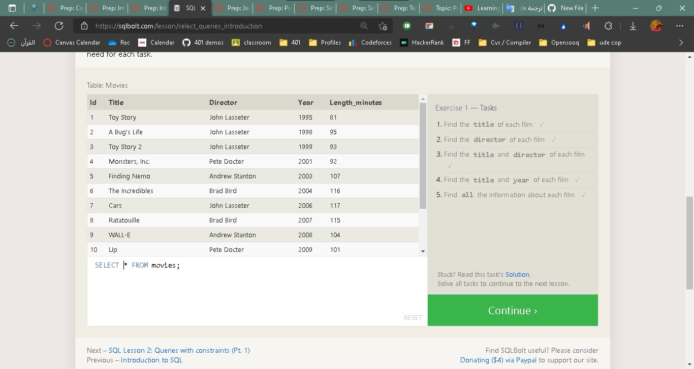
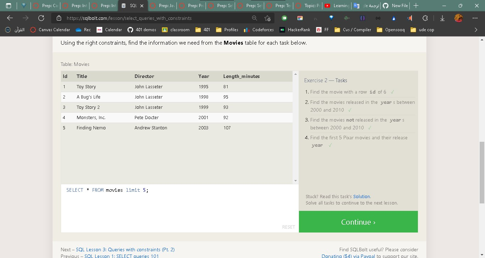
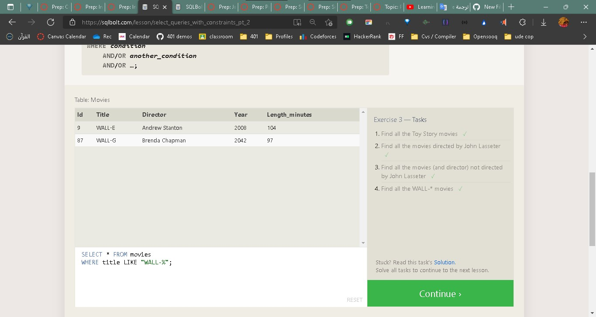
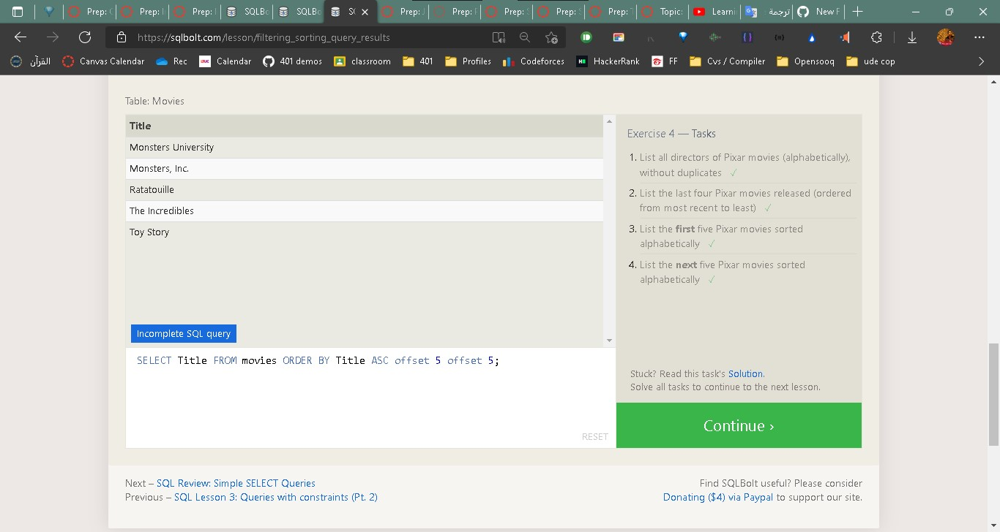
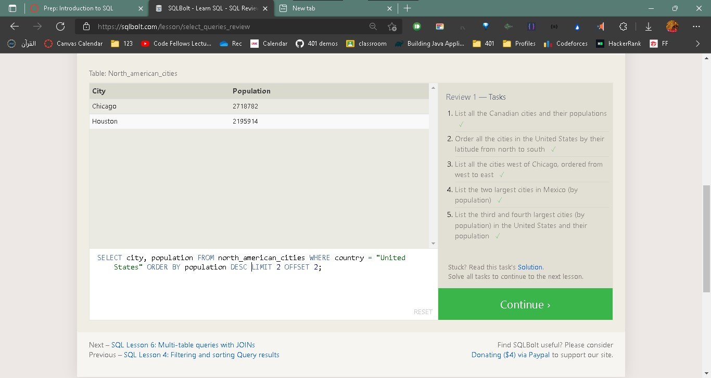
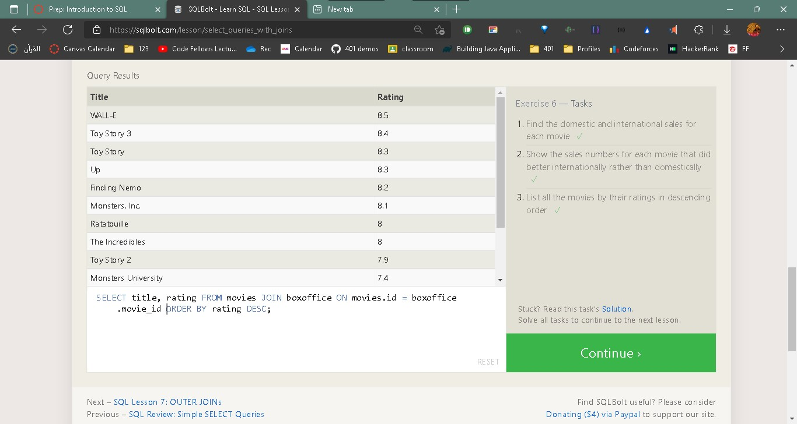

  
  
  A relational database is a collection of information that organizes data points with defined relationships for easy access. In the relational database model, the data structures -- including data tables, indexes and views -- remain separate from the physical storage structures, enabling database administrators to edit the physical data storage without affecting the logical data structure.

In the enterprise, relational databases are used to organize data and identify relationships between key data points. They make it easy to sort and find information, which helps organizations make business decisions more efficiently and minimize costs. They work well with structured data.

Basic SQL
Tables - for those familiar with Excel
SELECT
SELECT 42;
Return the number 42;
SELECT 'hello world!';
 return  string.
SELECT 5 * 12;
do some math on a result
FROM
ELECT data FROM a specific table.
SELECT [stuff you want to select] FROM [the table that it is in];
•	-> shortcut. The * is called a “splat”
SELECT * FROM [table name];	
used to get all columns	
ORDER BY
SELECT [stuff you want to select] FROM [the table that it is in] ORDER BY [column you want];
shows all the tracks ordered by “column you want”
ASCending and DESCendin
By default ascending order. You can choose to reverse that order by
specifying DESC

LIMIT and OFFSET
SELECT * FROM artists LIMIT [Number to Limit By];
OFFSET
ELECT * FROM artists LIMIT 5 OFFSET [Number of rows to skip];

from where to start returning data.

SQL can execute queries against a database
SQL can retrieve data from a database
SQL can insert records in a database
SQL can update records in a database
SQL can delete records from a database
SQL can create new databases
SQL can create new tables in a database
SQL can create stored procedures in a database
SQL can create views in a database
SQL can set permissions on tables, procedures, and views
  
  
  
  
  
  

